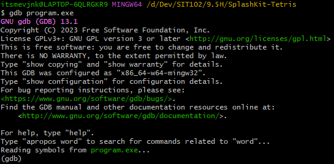
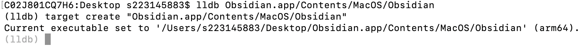
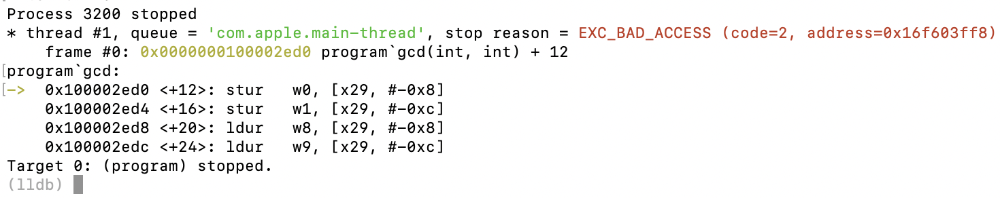
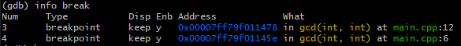
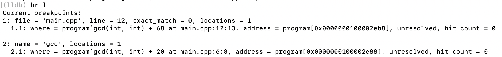
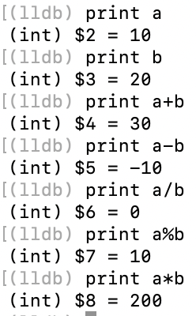
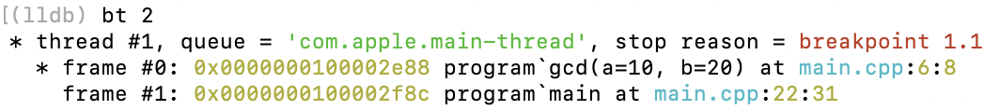

While it is sometimes enough to debug your programs using more traditional methods (such as manually reading through the code or writing debugging information to the terminal), as a program's complexity increases, this may eventually not be enough, and a debugging utility is needed.

This tutorial will guide you through the basics of the [GNU Debugger (`gdb`)](https://www.sourceware.org/gdb/), which is a popular and powerful debugger, as well as its macOS equivalent, [the LLVM Debugger (`lldb`)](https://lldb.llvm.org/).
# Setting up GDB/LLDB
## Windows/Linux
On Windows and Linux, if you have installed SplashKit following the [installation guide](https://splashkit.io/articles/installation/), there is a good chance that you already have GDB installed. However, if it is not available, you can install it as follows:
 - **Windows:** Run this command from the MSYS2 terminal: `pacman -S mingw-w64-x86_64-gdb`.
 - **Linux:** GDB is available on virtually all package managers and Linux distributions, so you can install it from there. (Note that on Debian, Ubuntu and their derivatives, the `build-essential` package already comes with GDB.)

Alternatively, you can choose to compile GDB yourself, but this is for more advanced users, and details may vary, so it will not be mentioned in more detail here.
## macOS
As macOS uses the LLVM toolchain, GDB is not available; however, its counterpart, the LLDB, can be used instead.

However, if you still insist on using GDB, it can still be installed with a bit more steps; see [this guide](https://dev.to/jasonelwood/setup-gdb-on-macos-in-2020-489k) for more details.
# Using the debugger
## Loading and running the program
Once you have the debugger installed, and you have compiled your program (with the `-g` parameter, which adds debugging information to the program), it is time to debug it. From the same directory as your program, run this command:

```bash
gdb program
```

or, with LLDB:

```
lldb program
```

where `program` is the name (including the extension) of your compiled program. For Windows, for example, it would be `program.exe`.

If you are successful, you would be greeted with this message:



or, if you are on macOS:



Pay attention to the next-to-last line - this indicates whether the program has been loaded successfully. If it instead says something like `program: No such file or directory.` (or `error: unable to find executable for 'program'`), it means that the specified file does not exist, so you should exit from the debugger using the `exit` command (note that Control-C does not work here).

Once you are ready, it is time to start the program. Simply run the `run` (or `r`) command. If there are any faults (such as `SIGSEGV` - short for *segmentation fault*, which is a common failure mode for memory-related bugs), the debugger will stop the program's execution and allow you to debug further:



***Note:** From this point on, the tutorial will present screenshots mostly from the LLDB debugger. LLDB and GDB syntaxes are virtually similar, with minor differences that will be highlighted as needed in the tutorial. Refer to [this documentation](https://developer.apple.com/library/archive/documentation/General/Conceptual/lldb-guide/chapters/A3-GDB-Summary.html) for the full list of differences.*

## Setting and deleting breakpoints
As with many things in life, it is best to be proactive in debugging, and catch the potentially faulty code lines before they execute. This is done using *breakpoints*, which can be set using the `b` command. The command can take either function names or code locations; for example, these are all valid commands:

```
b main.cpp:12
b gcd
```

The first command specifies the breakpoint location to be at line 12 of `main.cpp`, while the second one specifies the location to be at the start of the `gcd` function.

These breakpoints can then be listed for reference using these commands:
 - **GDB:** `info break`



 - **LLDB:** `br l`



In addition, you can delete these breakpoints using these commands:
 - **GDB:** `delete n`
 - **LLDB:** `br del n`

where `n` is the number of the breakpoint to be deleted.

## Continuing and stepping
Once the debugged program is stopped, it can either be continued again (obviously) using the `continue` (or `c` for short), or each line of code can be stepped through, allowing you to have a look at what the program is doing step-by-step and catch any unexpected behaviour.

There are two commands to step through each line of code:
 - `step` (or `s` for short), which steps through all lines, including stepping into called functions.
 - `next` (or `n` for short), which is similar to `step`; however, it does not step into called functions, and will treat these functions as an ordinary code line.

***Note:** The `continue` and `run` commands are different: the former resumes execution from a stopped program, while the latter starts execution of a newly-loaded program.*

## Printing variables
One of the most common actions in debugging is printing variables to check whether their values are as expected. In GDB and LLDB, this can be done using the `print` command:

```
print a
```

where `a` is a variable or expression (e.g. `a + b`) to be evaluated. For example:



## Backtrace
When a bug occurs, it is often extremely handy to know the sequence of events leading to the bug. This is called *backtracing* or *stacktracing*, and is done using the `bt` command:


The backtrace is listed in closest-first order; that is, the current function is listed first, then the line of code that called it is next, and so on. This allows the entire sequence of events to be traced, back to the main function. In addition, you can specify the number of stack frames to be included in the trace:



These are all the basics that you should know to start your journey into advanced debugging and building better and more stable programs. Happy debugging!